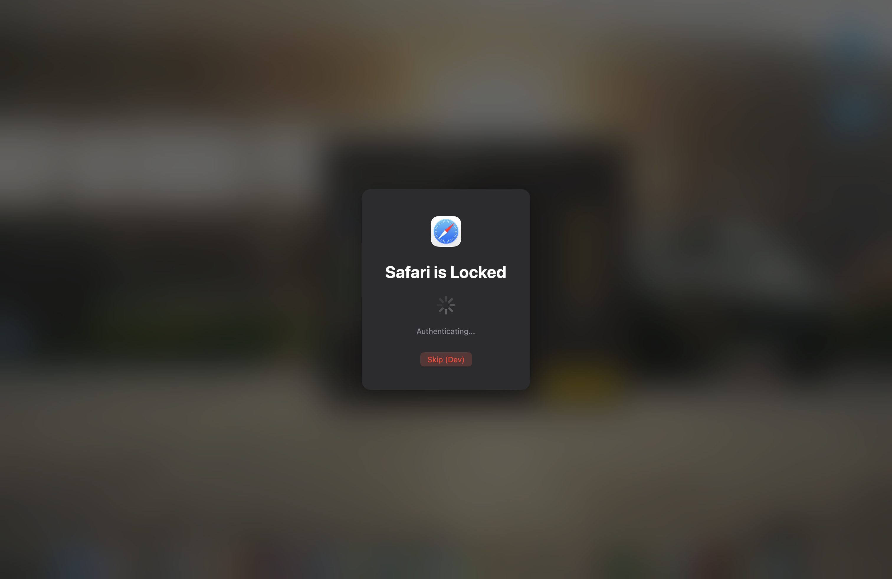
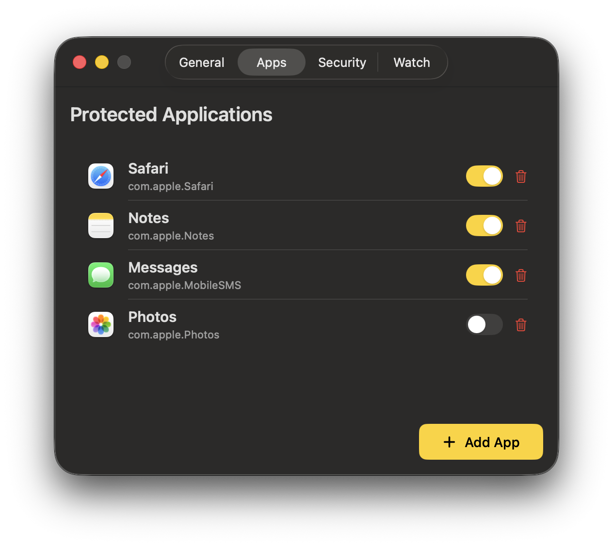

<p align="center">
  
</p>

<h1 align="center">MakLock</h1>

<p align="center">
  <strong>Lock any macOS app with Touch ID or password.</strong><br>
  Free and open source.
</p>

<p align="center">
  
  
  <a href="LICENSE"></a>
</p>

---

## What is MakLock?

MakLock is a lightweight menu bar app that protects your macOS applications with Touch ID or a backup password. When someone tries to open a protected app, MakLock shows a lock overlay and requires authentication before granting access.

### MakLock vs AppLocker

| Feature | MakLock | AppLocker |
|---------|:-------:|:---------:|
| Price | **Free** | $0.99/month |
| Touch ID unlock | Single prompt | Double prompt |
| Full-screen overlay | Yes | No |
| App termination on lock | Yes | No |
| Auto-lock on idle | Yes | No |
| Auto-lock on sleep | Yes | No |
| Apple Watch unlock | Yes | No |
| Open source | Yes | No |

## Features

- [x] Menu bar app (no Dock icon)
- [x] Lock apps with Touch ID
- [x] Password fallback
- [x] Full-screen blur overlay
- [x] Auto-lock after idle timeout
- [x] Auto-lock on sleep/wake
- [x] Apple Watch proximity unlock
- [x] Panic key emergency exit
- [x] System app blacklist (never locks Terminal, Xcode, etc.)
- [x] Multi-monitor support
- [x] First launch onboarding
- [x] Settings with tabbed UI
- [x] Quick protection toggle from menu bar

## Screenshots

<p align="center">
  
  <br><em>Full-screen blur overlay with Touch ID unlock</em>
</p>

<p align="center">
  
  <br><em>Settings with protected apps management</em>
</p>

<p align="center">
  
  <br><em>Menu bar with quick toggle and status</em>
</p>

## Installation

### Download

Download the latest `.dmg` from [**Releases**](https://github.com/dutkiewiczmaciej/maklock/releases/latest).

> MakLock is notarized by Apple for safe distribution outside the App Store.

### Build from Source

```bash
git clone https://github.com/dutkiewiczmaciej/maklock.git
cd maklock
open MakLock.xcodeproj
```

Build and run with `Cmd+R`. Requires Xcode 15+ and macOS 13+.

## Architecture

MakLock is a native Swift/SwiftUI application distributed outside the App Store for full overlay and process management capabilities.

```
MakLock/
  App/        Entry point, AppDelegate
  Core/       Services, Managers, Storage
  UI/         Design system, Components, Views
  Models/     Data models
  Resources/  Assets, Entitlements
```

**Key frameworks:** SwiftUI, AppKit, LocalAuthentication, CoreBluetooth, IOKit, HotKey (SPM)

## How It Works

1. **App Monitor** — watches for protected app launches via NSWorkspace notifications
2. **Lock Overlay** — shows a full-screen blur overlay on all displays
3. **Authentication** — prompts for Touch ID (or password fallback)
4. **Auto-lock** — re-locks on idle timeout, sleep, or Apple Watch out of range

## Safety

MakLock includes multiple safety mechanisms to ensure you never get locked out:

- **Panic key** — `Cmd+Option+Shift+Control+U` instantly dismisses all overlays
- **System blacklist** — Terminal, Xcode, Activity Monitor, and other system apps can never be locked
- **Timeout failsafe** — Overlays auto-dismiss after 60 seconds without interaction
- **Dev mode** — DEBUG builds include a Skip button and 10-second auto-dismiss

## Requirements

- macOS 13.0 (Ventura) or later
- Apple Silicon or Intel Mac
- Touch ID recommended (password fallback available)

## License

[MIT](LICENSE) — Made by [MakMak](https://github.com/dutkiewiczmaciej)
